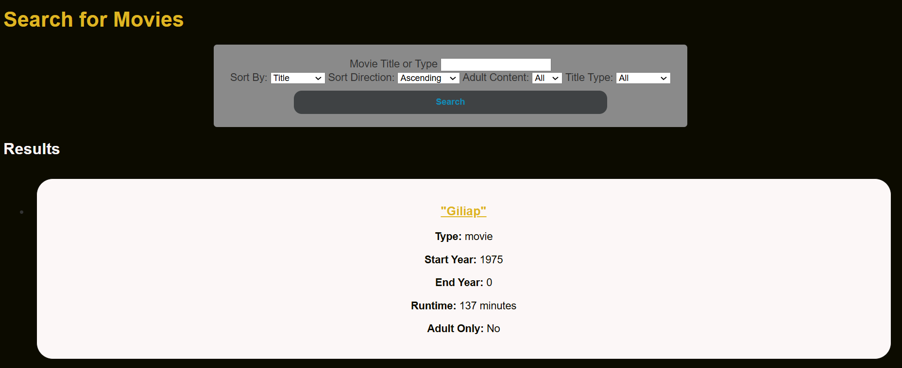
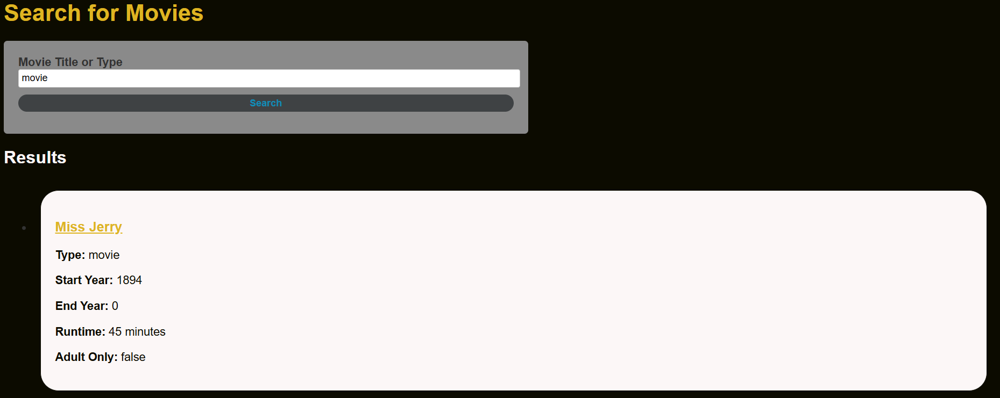
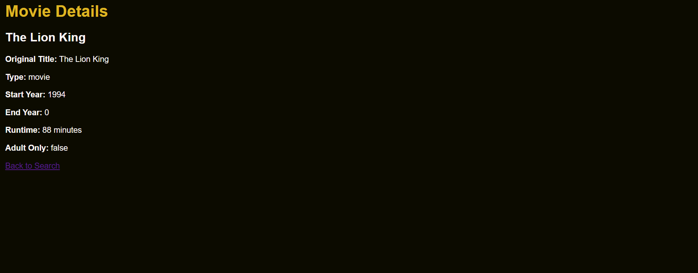

# Web IMDB Project
This project is a Spring Boot web application designed to read and process movie data from the IMDB file title.basics.tsv, save the data into a database, and provide a search functionality for users to explore.

## Features
**Read and Save Data:** The application reads data from a TSV file and saves it to a database.

**Search Movies:** Users can search for movies by title or type.

**Database Integration:** Uses an H2 database for storing movie details.

## Project Setup
### Step One
Clone the repository

### Step Two
Install dependencies

### Step Three
Go to https://datasets.imdbws.com/ and download the title.basics.tsv.gz file.

### Step Four
Extract this and copy the .tsv file into the resources folder.

### Step Five
Run the application.

### Step Six
Access the application at http://localhost:8080/search

## Screenshots
### Search Page

### Results Page

### Details Page
